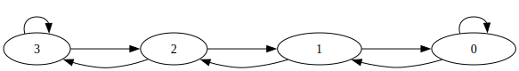

# 計算機アーキテクチャ

分岐予測が毎年出ている。浮動小数点の問題も頻繁に出ている。問題をNotebookLMに列挙させてみる。

> *   **2010年 専門基礎B B-6**
>     *   スーパースカラプロセッサ (Superscalar processor)
>     *   割り込み (Interrupt)
>     *   仮想記憶とは何か説明せよ。仮想記憶を用いる利点を説明せよ。
>     *   TLB (Translation Look-aside Buffer) とは何か説明せよ。アドレス変換においてTLBがどのように動作するかを説明せよ。
> *   **2012年 専門基礎B B-6**
>     * (2) 割り込みについて、以下の問に答えよ。
>       * (a) 割り込みとは何か、また、割り込みが必要な理由を述べよ。
>       * (b) システムコール (スーパバイザコールとも言う) とは何か説明せよ。システムコールが必要な理由を述べよ。
> *   **2015年 専門基礎B B-6**
>     *   スーパースカラプロセッサ (Superscalar processor)
>     *   ポーリング (Polling) と割り込み (Interrupt)
>     *   制御 (分岐) ハザード (Control (branch) hazard)
> *   **2016年 専門基礎B B-8**
>     * (1) 計算機のユーザモードとカーネルモード (スーパバイザモード) について説明せよ。また、これらとオペレーティングシステムの関係を説明せよ。
>     * (2) ユーザモードで禁止される代表的な特権操作を列挙せよ。
>     * (3) ユーザプログラムからシステムコールを行う手順を説明せよ。通常の関数呼び出しとの違いを明確にすること。
>     * (4) 最小特権の原則を説明せよ。
>     * (5) マイクロカーネルとモノリシックカーネルの違いを説明し、それぞれの利点・欠点を議論せよ。
>     * (6) 仮想化システムにおいて、ゲストオペレーティングシステムのシステムコールがどのように実行されるか説明せよ。
> *   **2017年 専門基礎B B-5**
>     *   スーパースカラプロセッサ (Superscalar processor)
>     *   ポーリング (Polling) と割り込み (Interrupt)
>     *   制御 (分岐) ハザード (Control (branch) hazard)
> *   **2018年 専門基礎B B-8**
>     * (1) プロセス制御ブロックに保持される情報について説明せよ。
>     * (2) Cプログラムの実行時に割り当てられるプロセスメモリ空間のセグメント (セクション) を列挙せよ。各セグメント (セクション) が何に用いられるか説明せよ。
>     * (3) 共有ライブラリを用いることの利点と問題点を説明せよ。
> *   **2019年 専門基礎B B-5**
>     *   スーパースカラプロセッサ (Superscalar processor)
>     *   ポーリング (Polling) と割り込み (Interrupt)
>     *   制御 (分岐) ハザード (Control (branch) hazard)
> *   **2020年 専門基礎B B-6**
>     *   浮動小数点演算 (floating point arithmetic) を同時に最大1命令実行 (single issue) 可能で、そのCPI (Clock Per Instruction) が、加減算 (addition/subtraction) は4、乗算 (multiplication) は6、除算 (division) は10であるプロセッサがある。浮動小数点演算の割合が、加減算 50%、乗算 40%、除算 10%のプログラムをこのプロセッサに実行させ るものとする。クロック周波数 (clock frequency) が 1.35GHzのとき、理想的な状況で の MFLOPS (Million Floating-point Operations Per Second) 値を求めよ。
>     *   (2) SISD (single instruction, single data stream) プロセッサの命令パイプライン制御 (instruction pipeline control) について以下の問に答えよ。
>     *   (3) キャッシュメモリ (cache memory) 方式について、以下の問に答えよ。
>     *   (4) 割り込み (interrupt) について、以下の問に答えよ。
> *   **H21 専門基礎B B-1**
>     * (2) インターネット (Internet) では IP アドレス (IP address)、MAC アドレス (Medium Access Control address)、ドメイン名 (domain name) の3種類のどのアドレスが用いられるか説明せよ。
> *   **km_2022_cce 専門基礎B B-5**
>     * (1) 32ビット語長・バイトアドレッシングのRISCプロセッサP1、P2およびP3は、それぞれ命令 キャッシュI1、I2およびI3を持つ。以下の問に答えよ。以下の問では全てのアクセスは16進 数で表されている。

規則性が見え見えなんだけど、最近の問題を見ているとあんまりこれをやる意味はない気がする・・・
高木研がなくなったからハードの問題がBででないだろうし、Aではこういうのは聞かれなさそう。まあパイプライン処理とかは出ると思うからやるべきではあるけど。

## 分岐予測

### 制御ハザード

分岐命令をロードしたとき、実際に条件部を評価してPCを動かす前に次の命令を読み込んでおり、分岐が成立した場合にその命令を破棄する（ストールを流す）必要がある。
分岐予測によって、このストールを減らすことができる。分岐予測の方法には成立分岐予測、不成立分岐予測、2ビット予測などがある。

### 成立・不成立分岐予測

静的分岐予測の一種。条件分岐命令で常に分岐する・しないと仮定する方法。予測と結果が合えば、ストールを出す必要がなくなる。

### 2ビット予測

